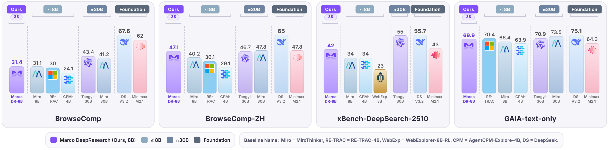

# Marco-DeepResearch

<p align="center">
  <a href="README_zh.md">🌐 中文</a> •
  <a href="https://arxiv.org/abs/2603.28376">📄 Paper</a> •
  <a href="https://huggingface.co/AIDC-AI/Marco-DeepResearch-8B">🤗 HuggingFace</a> •
  <a href="MODEL_CARD.md">📋 Model Card (EN)</a> •
  <a href="MODEL_CARD_zh.md">📋 模型卡 (中文)</a>
</p>

**Marco-DeepResearch** is an efficient 8B-scale deep research agent developed by **Alibaba International Digital Commerce (AIDC-AI)**. It autonomously conducts open-ended investigations by integrating complex information retrieval with multi-step reasoning across diverse web sources.

Marco-DeepResearch is optimized through a **verification-centric framework** at three levels:

1. **Verified Data Synthesis** — Graph-based and agent-based QA synthesis with explicit verification to control difficulty and ensure answer uniqueness/correctness.
2. **Verification-Driven Trajectory Construction** — A multi-agent framework (main agent + search sub-agent + verifier sub-agent) that injects explicit verification patterns into training trajectories.
3. **Verifier-Guided Test-Time Scaling** — Uses the agent itself as a verifier at inference time, achieving **+12.1 avg. improvement** on benchmarks.

Under a maximum budget of **600 tool calls**, Marco-DeepResearch significantly outperforms 8B-scale agents and surpasses or approaches several 30B-scale agents (e.g., Tongyi DeepResearch-30B) on challenging benchmarks.

This repository open-sources the **inference framework code** of Marco-DeepResearch, which can be used to reproduce the benchmark results in our paper.

## ✨ Features

- 🤖 **Open Model**: [Marco-DeepResearch-8B](https://huggingface.co/AIDC-AI/Marco-DeepResearch-8B) — Qwen3-8B base, 128K context, trained with SFT + RL
- ✅ **Verification-Centric**: Explicit verification across data synthesis, trajectory construction, and inference
- 🔍 **Multi-Tool Support**: Built-in Search and Visit (web browsing) tools
- 📊 **Multi-Benchmark Support**: GAIA, BrowseComp (EN/ZH), xBench-DeepSearch (2505/2510), WebWalkerQA, DeepSearchQA, HLE, etc.
- ⚙️ **Flexible Config**: Decoupled Profile (model/strategy) and Benchmark (dataset) configs
- 🚀 **Efficient Execution**: Multi-threaded concurrency, multi-rollout inference
- 🎯 **Dual Execution Modes**: Efficiency mode (early stop) and Accuracy mode (context compression + max rollouts)

## 📊 Benchmark Results

Evaluated on deep search benchmarks under a maximum budget of **600 tool calls**. Marco-DR-8B leads all 8B-scale peers and matches or surpasses 30B-scale agents on multiple tasks:

<p align="center">
  
</p>

| Model | BrowseComp | BrowseComp-ZH | GAIA (text-only) | WebWalkerQA | xBench-DS-2505 | xBench-DS-2510 | DeepSearchQA | HLE-Text |
|---|:---:|:---:|:---:|:---:|:---:|:---:|:---:|:---:|
| *Foundation Models with Tools* | | | | | | | | |
| GLM-4.7 | 67.5 | 66.6 | 61.9 | – | 72.0 | 52.3 | – | 42.8 |
| Minimax-M2.1 | 62.0 | 47.8 | 64.3 | – | 68.7 | 43.0 | – | 19.1 |
| DeepSeek-V3.2 | 67.6 | 65.0 | 75.1 | – | 78.0 | 55.7 | 60.9 | 40.8 |
| Kimi-K2.5 | 74.9 | 62.3 | – | – | – | 46.0 | 77.1 | – |
| Claude-4-Sonnet | 12.2 | 29.1 | 68.3 | 61.7 | 64.6 | – | – | – |
| Claude-4.5-Opus | 67.8 | 62.4 | – | – | – | – | 80.0 | – |
| OpenAI-o3 | 49.7 | 58.1 | – | 71.7 | 67.0 | – | – | – |
| OpenAI GPT-5 High | 54.9 | 65.0 | 76.4 | – | 77.8 | 75.0 | 79.0 | – |
| Gemini-3.0-Pro | 59.2 | 66.8 | – | – | – | 53.0 | 76.9 | – |
| *Trained Agents (≥30B)* | | | | | | | | |
| MiroThinker-v1.7-mini | 67.9 | 72.3 | 80.3 | – | – | 57.2 | 67.9 | 36.4 |
| MiroThinker-v1.5-235B | 69.8 | 71.5 | 80.8 | – | 77.1 | – | – | 39.2 |
| MiroThinker-v1.5-30B | 56.1 | 66.8 | 72.0 | – | 73.1 | – | – | 31.0 |
| MiroThinker-v1.0-72B | 47.1 | 55.6 | 81.9 | 62.1 | 77.8 | – | – | 37.7 |
| MiroThinker-v1.0-30B | 41.2 | 47.8 | 73.5 | 61.0 | 70.6 | – | – | 33.4 |
| SMTL-30B-300 | 48.6 | – | 75.7 | 76.5 | 82.0 | – | – | – |
| Tongyi-DR-30B | 43.4 | 46.7 | 70.9 | 72.2 | 75.0 | 55.0 | – | 32.9 |
| WebSailor-V2-30B | 35.3 | 44.1 | 74.1 | – | 73.7 | – | – | – |
| DeepMiner-32B-RL | 33.5 | 40.1 | 58.7 | – | 62.0 | – | – | – |
| OpenSeeker-30B-SFT | 29.5 | 48.4 | – | – | 74.0 | – | – | – |
| *Trained Agents (≤8B)* | | | | | | | | |
| AgentCPM-Explore-4B | 24.1 | 29.1 | 63.9 | 68.1 | 70.0 | 34.0* | 32.8* | 19.1 |
| WebExplorer-8B-RL | 15.7 | 32.0 | 50.0 | 62.7 | 53.7 | 23.0* | 17.8* | 17.3 |
| RE-TRAC-4B | 30.0 | 36.1 | 70.4 | – | 76.6 | – | – | 22.2 |
| MiroThinker-v1.0-8B | 31.1 | 40.2 | 66.4 | 60.6 | 60.6 | 34.0* | 36.7* | 21.5 |
| **Marco-DR-8B (Ours)** | **31.4** | **47.1** | **69.9** | **69.6** | **82.0** | **42.0** | **29.9** | **22.5** |

> \* marks scores we reproduced with our own implementation; other scores are from the respective official reports.

## 📦 Installation

### 1. Clone the repository

```bash
git clone <repository_url>
cd marco_search
```

### 2. Prepare datasets

Download the evaluation datasets you need (e.g., GAIA, BrowseComp, xBench, WebWalkerQA), convert them to JSONL format, and place them under `dataset/`:

```bash
mkdir -p dataset
# Place downloaded dataset files under dataset/, for example:
# dataset/gaia_text_only.jsonl
# dataset/browsecomp_en.jsonl
# dataset/browsecomp_zh.jsonl
# ...
```

> The file path and field mapping for each benchmark are defined in `configs/benchmarks/<benchmark>.yaml` and can be adjusted as needed. See the [Adding a new benchmark](#-adding-a-new-benchmark) section below for the data format.

### 3. Install dependencies

```bash
pip install -r requirements.txt
```

### 4. Configure the runner script

Edit `run.sh` to set environment variables and runtime parameters:

```bash
# Main model (agent inference)
export OPENAI_API_KEY="EMPTY"
export OPENAI_BASE_URL="http://localhost:40001/v1"
export MODEL_NAME="your-model-name"

# Search tool (Google via Serper)
export GOOGLE_SEARCH_KEY="your_serper_api_key"
# export SEARCH_API_URL="https://google.serper.dev/search"   # Optional; this is the default

# Web-visit tool
export JINA_API_KEY="your_jina_api_key"                     # Jina Reader key; fallback when plain requests fail

# Summary model (used internally by the Visit tool; can differ from the main model)
export SUMMARY_MODEL_OPENAI_API_KEY="your_summary_api_key"
export SUMMARY_MODEL_OPENAI_BASE_URL="your_summary_api_base"
export SUMMARY_MODEL_NAME="your_summary_model_name"

# Run config
BENCHMARK="gaia"              # Benchmark name
PROFILE="efficiency"          # Profile: efficiency, accuracy (empty = default)
WORKERS=5                     # Concurrency
ROLLOUT=8                     # Rollout count
OUTPUT_DIR="output"           # Output path
```

## 🏗️ Project Structure

```
marco_search/
├── configs/                    # Config files
│   ├── default.yaml           # Default config
│   ├── profiles/              # Profile configs (model, strategy)
│   │   ├── accuracy.yaml
│   │   └── efficiency.yaml
│   └── benchmarks/            # Benchmark configs (datasets)
│       ├── gaia.yaml
│       ├── browsecomp_en.yaml
│       ├── browsecomp_zh.yaml
│       ├── xbench-DeepSearch-2505.yaml
│       ├── xbench-DeepSearch-2510.yaml
│       ├── webwalker.yaml
│       ├── deepsearchqa.yaml
│       ├── hle.yaml
│       └── ...                # Other benchmark variants (e.g. *_sample.yaml)
├── marco/                      # Core code
│   ├── agent/                 # Agent implementations
│   │   ├── base.py            # Agent base class
│   │   ├── marco_agent.py     # MarcoAgent main implementation
│   │   ├── context_manager.py # Context management / compression
│   │   ├── response_parser.py # Response parser
│   │   └── constants.py       # Shared constants
│   ├── tools/                 # Tool modules
│   │   ├── base.py            # Tool base class
│   │   ├── search.py          # Search tool (Google via Serper)
│   │   ├── visit.py           # Web visit tool (fetch + summarize)
│   │   └── readpage.py        # Page reading helper
│   ├── runner/                # Runner modules
│   │   └── benchmark_runner.py  # Benchmark runner
│   ├── prompts/               # Prompt templates
│   │   └── inference.py       # Inference prompts
│   └── utils/                 # Utilities
│       ├── config.py          # Config manager
│       └── llm_client.py      # LLM client
├── tokenizer/                  # Custom tokenizer assets
├── dataset/                    # Datasets (to be prepared by the user)
├── output/                     # Outputs (generated at runtime)
├── run.sh                      # Main runner script (recommended)
├── run_benchmark.py            # Inference entry point
└── requirements.txt            # Dependencies
```

## 🚀 Quick Start

### 1. Configure run parameters

Edit `run.sh`:

```bash
# Main model (required)
export OPENAI_API_KEY="EMPTY"
export OPENAI_BASE_URL="http://localhost:40001/v1"
export MODEL_NAME="your-model-name"

# Tool-related env vars (required; see "Configure the runner script" above for details)
export GOOGLE_SEARCH_KEY="your_serper_api_key"
export JINA_API_KEY="your_jina_api_key"
export SUMMARY_MODEL_OPENAI_API_KEY="your_summary_api_key"
export SUMMARY_MODEL_OPENAI_BASE_URL="your_summary_api_base"
export SUMMARY_MODEL_NAME="your_summary_model_name"

# Run config
BENCHMARK="gaia"              # Benchmark: gaia, xbench-DeepSearch-2510, browsecomp_zh, etc.
PROFILE="efficiency"          # Profile: efficiency, accuracy (empty = default)
WORKERS=5                     # Concurrent workers
ROLLOUT=8                     # Rollouts per question
OUTPUT_DIR="output"           # Output path
```

### 2. Run a benchmark

```bash
./run.sh
```

### 3. List available configs (optional)

```bash
python run_benchmark.py list
```

## ⚙️ Configuration

### Config loading order

Marco uses a layered config mechanism. Configs are loaded and overridden in this order:

1. **`configs/default.yaml`** — default values for all config items
2. **`configs/profiles/<profile>.yaml`** — profile config (model, strategy, agent behavior)
3. **`configs/benchmarks/<benchmark>.yaml`** — benchmark config (dataset path, field mapping)

### Command-line arguments

| Arg | Short | Description | Default |
|---|---|---|---|
| `--benchmark` | `-b` | Benchmark name (required) | - |
| `--profile` | `-p` | Profile name | `default` |
| `--model` | `-m` | Override model name | env var or config |
| `--output-dir` | `-o` | Output directory | `output` |
| `--data-path` | | Override dataset path | from config |
| `--max-workers` | `-w` | Concurrent workers | `5` |
| `--rollout-count` | `-n` | Rollouts per question | `8` |
| `--temperature` | | LLM temperature | `0.7` |
| `--top-p` | | Top-p sampling | `0.95` |

### Profile config

Profile configs define model, strategy, and agent behavior. Located in `configs/profiles/`:

```yaml
# configs/profiles/accuracy.yaml
model:
  name: "gpt-4o"
  api_key_env: "OPENAI_API_KEY"
  api_base_env: "OPENAI_BASE_URL"

agent:
  execution_mode: "accuracy"       # Accuracy: try to use all rollouts
  context_compress_enabled: true    # Enable context compression
  context_compress_strategy: "summarize"

generation:
  temperature: 0.3                  # Lower temp, more stable
  max_tokens: 8192

runner:
  max_workers: 5                    # Moderate concurrency
  rollout_count: 8                  # Multiple rollouts for TTS verify
```

### Tool config

Tool configs live under the `tools` section of `configs/default.yaml`. Two tools are shipped out of the box: `search` (Google via Serper) and `visit` (plain HTTP + Jina Reader fallback, paired with an LLM for goal-oriented summarization).

```yaml
tools:
  enabled:
    - search
    - visit

  # Search: Google via Serper API.
  # Secrets are injected via env vars: GOOGLE_SEARCH_KEY, SEARCH_API_URL
  search:
    timeout: 20                 # Per-request timeout (seconds)
    max_retries: 5              # Retries per query
    max_workers: 10             # Concurrency across queries
    max_results_per_query: 10   # Number of results returned per query

  # Visit: fetch a page, then produce a goal-oriented summary.
  # Secrets are injected via env vars:
  #   JINA_API_KEY, SUMMARY_MODEL_OPENAI_API_KEY,
  #   SUMMARY_MODEL_OPENAI_BASE_URL, SUMMARY_MODEL_NAME
  visit:
    mode: "hybrid"              # requests | jina | hybrid (default hybrid: requests first, then Jina on failure)
    timeout: 15                 # Per-fetch timeout (seconds)
    max_retries: 5              # Fetch retries
    max_workers: 3              # Concurrency across URLs
    max_content_length: 409600  # Char limit before content is passed to the summary LLM
    summary_max_tokens: 4096    # Max tokens generated per summary
    summary_max_retries: 5      # Retries for the summary LLM call
```

Profiles and benchmark configs can override any of the fields above—e.g. lowering `max_content_length` / `summary_max_tokens` in `configs/profiles/efficiency.yaml` to cut cost.

### Benchmark config

Benchmark configs define the dataset. Located in `configs/benchmarks/`:

```yaml
# configs/benchmarks/gaia.yaml
benchmark:
  name: "gaia"
  description: "GAIA Benchmark"
  data_path: "dataset/gaia_text_only.jsonl"

# Data field mapping
field_mapping:
  question: "question"    # Question field
  answer: "answer"        # Answer field
  task_id: "task_id"      # Task ID field

# Override default config
generation:
  temperature: 0.7
  max_tokens: 8192

runner:
  max_workers: 5
  rollout_count: 8
```

### Default config

The default config lives in `configs/default.yaml` and contains defaults for all items. Profile and benchmark configs override matching keys.

## 📝 Usage Examples

### Example 1: Quick test

Edit `run.sh`:
```bash
BENCHMARK="gaia"
PROFILE="efficiency"
WORKERS=1
ROLLOUT=1
OUTPUT_DIR="output_test"
```

Then:
```bash
./run.sh
```

### Example 2: Accuracy mode

Edit `run.sh`:
```bash
BENCHMARK="gaia"
PROFILE="accuracy"       # Use accuracy profile (enables context compression)
WORKERS=5
ROLLOUT=5
OUTPUT_DIR="output_accuracy"
```

Then:
```bash
./run.sh
```

### Example 3: Custom config

Edit `run.sh`:
```bash
BENCHMARK="gaia"
PROFILE="efficiency"
WORKERS=20                # High concurrency
ROLLOUT=5                 # More rollouts
OUTPUT_DIR="output_custom"
```

Then:
```bash
./run.sh
```

## 🔧 Adding a new benchmark

### 1. Create a benchmark config file

Create a config file under `configs/benchmarks/`:

```yaml
# configs/benchmarks/my_benchmark.yaml
benchmark:
  name: "my_benchmark"
  description: "My custom benchmark"
  data_path: "dataset/my_benchmark.jsonl"

# Data field mapping (adjust to your dataset)
field_mapping:
  question: "query"           # Question field
  answer: "gold_answer"       # Answer field
  task_id: "id"               # Task ID field

# Optional: override default config
generation:
  temperature: 0.7
  max_tokens: 8192
```

### 2. Prepare the dataset

Prepare a JSONL file, one JSON object per line:

```jsonl
{"id": "task_1", "query": "What is the capital of France?", "gold_answer": "Paris"}
{"id": "task_2", "query": "Who wrote Romeo and Juliet?", "gold_answer": "William Shakespeare"}
```

Place the file at `dataset/my_benchmark.jsonl`.

### 3. Run the benchmark

Edit `run.sh`, set `BENCHMARK="my_benchmark"`, and run:

```bash
./run.sh
```

## 📊 Output Structure

Results are saved under `output/`:

```
output/
└── model_name/
    └── benchmark_name/
        ├── iter1.jsonl              # Rollout 1 results
        ├── iter2.jsonl              # Rollout 2 results
        └── iter3.jsonl              # Rollout 3 results
```

Each `iter*.jsonl` file contains detailed results per rollout:
- `question`
- `final_answer` (agent's final answer)
- `reasoning_steps`
- `token_usage`
- `execution_time`

## 🎯 Agent Execution Modes

Marco Agent supports two execution modes:

- **`efficiency`**: stop as soon as any limit is hit (token count or round count). Good for quick tests.
- **`accuracy`**: try to use all rollouts. When tokens run low, context is automatically compressed. Good for pushing accuracy.

Set via `agent.execution_mode` in the profile or default config.

## 🔍 Supported Benchmarks

- **GAIA** (text-only): General AI Assistant benchmark
- **BrowseComp** (EN / ZH): Web browsing comprehension benchmark
- **xBench-DeepSearch** (2505 / 2510): Multi-turn deep-search evaluation
- **WebWalkerQA**: Web navigation & multi-hop QA
- **DeepSearchQA**: Deep-search question answering
- **HLE** (text): Human-like evaluation benchmark

## 📚 Dependencies

Main packages (see `requirements.txt`):

- `openai`: OpenAI API client
- `pyyaml`: YAML config parser
- `tqdm`: Progress bar
- `tiktoken`: Token counting (optional, recommended)
- `transformers`: Custom tokenizer support (optional, for models not in tiktoken)

## 🎯 Intended Use

Marco-DeepResearch is designed for:

- **Open-ended web research** — Autonomously investigating complex questions across multiple web sources
- **Multi-hop question answering** — Solving questions that require chaining information from multiple documents
- **Information seeking** — Navigating the web to locate specific, hard-to-find information
- **Fact verification** — Verifying claims through multi-source evidence aggregation

## ⚠️ Limitations

- Performance depends on the quality and accessibility of external web search tools and APIs.
- The model is optimized for information-seeking tasks and may not generalize to all types of reasoning tasks.
- Enabling test-time scaling introduces extra inference overhead; the number of tool-call rounds can be tuned based on the use case.

## 🤝 Contributing

Issues and Pull Requests are welcome!

## 📚 Citation

If you find this work helpful, please cite:

```bibtex
@article{zhu2026marco,
  title={Marco DeepResearch: Unlocking Efficient Deep Research Agents via Verification-Centric Design},
  author={Bin Zhu and Qianghuai Jia and Tian Lan and Junyang Ren and Feng Gu and Feihu Jiang and Longyue Wang and Zhao Xu and Weihua Luo},
  journal={arXiv preprint arXiv:2603.28376},
  year={2026}
}
```

## 📄 License

This project is released under the [Apache 2.0 License](LICENSE).
